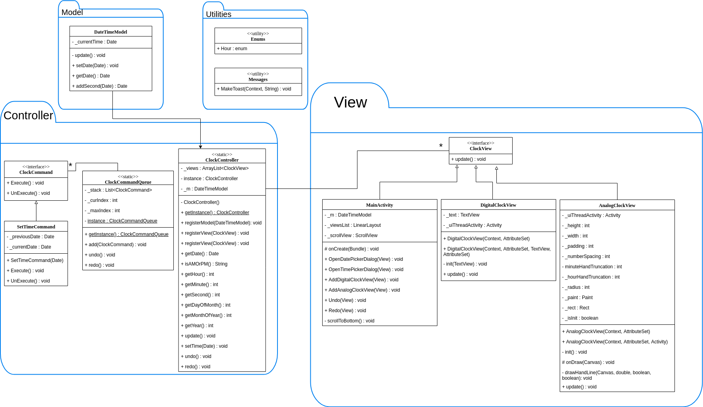

# clocks-app
This application is my code for the second homework for CEG 4110 at WSU. The intention of this assignment is to test the student's ability to create a project using an MVC design pattern. The application allows the user to display as many analog and/or digital clock views as they want. The user is able to set the time and date and all of the clock views will update concurrently. The user also has the ability to undo and redo the time changes they make.

<p align="center>

 

 

</p>

### Design and Implementation

This application was created using the Model View Controller (MVC) design pattern. The idea is separation of concerns so we get a cleaner, more easily maintained piece of software. A utilities package has also been included for convenience, although it was primarily there for testing purposes.

The model is made up of the `DateTimeModel` class which holds the current state of the application; in this case it is the currently set time and date.

The controller is made up of a main controller which exists in the `ClockController` class. This class is a singleton which can be accessed across the application. There is one command which implements the `ClockCommand` interface in the `SetTimeCommand` class. The `ClockCommandQueue` class is another singleton which keeps track of the commands so we can "undo" and "redo" them utilizing a stack data structure.

The view is made up of several views, including the `MainActivity` class (which also acts as the insertion point) and the `DigitalClockView` as well as the `AnalogClockView` which both implement the `ClockView` interface. This allows us to add the views to a list in the controller so all of the views can be updated simultaneously.

The utils package consists of an `Enums` class and a `Messages` class. The former is used to iterate over each of the hours on an analog clock when we are drawing the clock face, and the latter is used to display toasts easily to any context. This was used primarily when testing.

The following is a UML diagram of the program:



### Dependencies

The dependencies in this project comes from the DateTimePicker with seconds, a project which [can be found here](https://github.com/IvanKovac/TimePickerWithSeconds) and this awesome [floating action button menu](https://github.com/Clans/FloatingActionButton).
```
dependencies {
    ...
        implementation 'com.github.clans:fab:1.6.4'
        implementation ('com.kovachcode:timePickerWithSeconds:1.0.1') {
            exclude group: 'com.android.support'
            exclude module: 'appcompat-v7'
            exclude module: 'support-v4'
        }
    ...
}
```
_Note: The extra bit is added to the time picker dependency because it was conflicting with compatibility support verions_